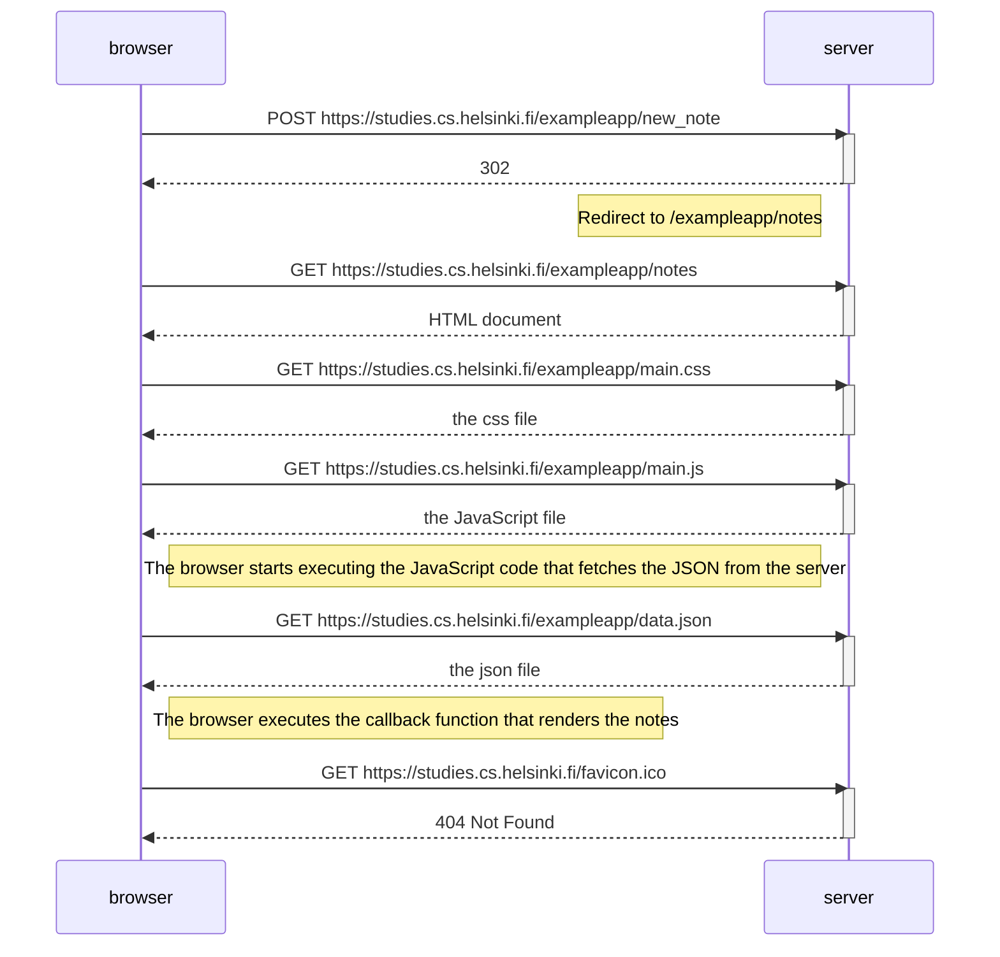

##Flowchart
 

```mermaid
sequenceDiagram
    participant browser
    participant server

    browser->>server: POST https://studies.cs.helsinki.fi/exampleapp/new_note 
    activate server
    server-->>browser: 302
    deactivate server
    Note left of server: Redirect to /exampleapp/notes
    browser->>server: GET https://studies.cs.helsinki.fi/exampleapp/notes
    activate server
    server-->>browser: HTML document
    deactivate server

    browser->>server: GET https://studies.cs.helsinki.fi/exampleapp/main.css
    activate server
    server-->>browser: the css file
    deactivate server

    browser->>server: GET https://studies.cs.helsinki.fi/exampleapp/main.js
    activate server
    server-->>browser: the JavaScript file
    deactivate server

    Note right of browser: The browser starts executing the JavaScript code that fetches the JSON from the server

    browser->>server: GET https://studies.cs.helsinki.fi/exampleapp/data.json 
    activate server
    server-->>browser: the json file
    deactivate server
    Note right of browser: The browser executes the callback function that renders the notes

    browser->>server: GET https://studies.cs.helsinki.fi/favicon.ico
    activate server
    server-->>browser: 404 Not Found
    deactivate server


    
```